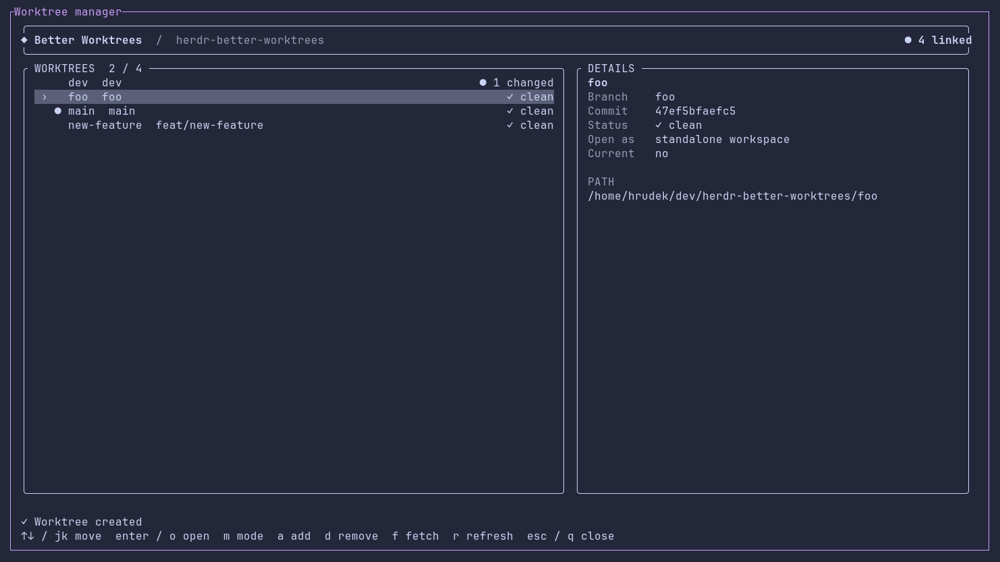

# Herdr Better Worktrees

Interactive Herdr popup for repositories using the canonical layout:

```text
repo/
  .git        # gitdir: ./.bare
  .bare/      # shared bare repository
  main/       # linked worktree
  topic/      # linked worktree
```

Git remains the source of truth. The plugin lists porcelain worktree data, checks every checkout's status, fetches, creates, and safely removes through argument-safe Git commands. Herdr is only used to host the popup and to open an existing checkout. By default a checkout opens as a standalone workspace; nested Herdr worktree grouping remains available as an optional open mode.



## Install

Requirements: Herdr 0.9+, Node.js 20+, Git, npm, and Linux or macOS.

Install the plugin directly from GitHub:

```bash
herdr plugin install bearylabs/herdr-better-worktrees
```

## Use

Invoke the plugin while the focused pane is inside a canonical root or one of its linked worktrees:

```bash
herdr plugin action invoke herdr-better-worktrees.manage
```

To make it readily accessible, add a keybinding to `~/.config/herdr/config.toml`:

```toml
[[keys.command]]
key = "prefix+t"
type = "plugin_action"
command = "herdr-better-worktrees.manage"
description = "manage canonical worktrees"
```

## Keys

- `↑`/`↓` or `j`/`k`: select
- `Enter`/`o`: open selected worktree in Herdr
- `m`: toggle between a standalone workspace (default) and nested worktree grouping
- `a`: create
- `d`: remove (clean, unlocked, non-current worktrees only)
- `f`: fetch/prune `origin`
- `r`: refresh
- `Esc`/`q`: close

Creation uses `scripts/new-worktree.sh`: enter a directory name and press `Enter` immediately, or use `Tab` to fill the optional branch and base fields. An omitted branch defaults to the directory name. The script reuses a local branch, tracks a matching remote branch, or creates a branch from the supplied/default base. Branch deletion after removal uses `git branch -d`, never forced deletion.

## Herdr workspace modes

The default standalone mode first checks Herdr's workspaces and panes for the selected checkout. If it is already open, the plugin renames and focuses that workspace; otherwise it creates one. Standalone workspaces inherit the name of the workspace from which the manager was opened, and duplicates are prevented. The optional nested mode uses Herdr's native sidebar grouping and labels the worktree with its branch name (or its checkout directory when detached). Toggle the mode with `m` before opening a worktree.

Worktree creation itself deliberately bypasses Herdr so its path policy cannot move checkouts outside the canonical root.

## Inspiration

This plugin was inspired by the [`pi-worktrees` extension in dmmulroy's dotfiles](https://github.com/dmmulroy/.dotfiles).
